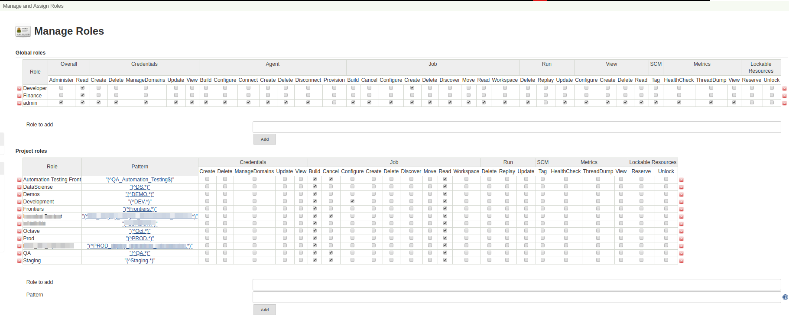
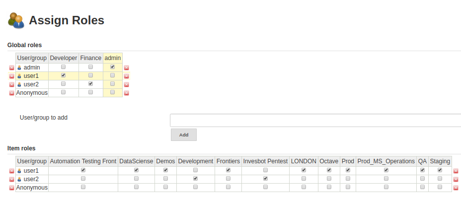

# Jenkins Jcasc

## Summary
Jenkins as Code plugin has been designed as an opinionated way to configure Jenkins based on human-readable declarative configuration files. Writing such a file should be suitable without being a Jenkins expert, just translating into code a configuration process one is used to executing in the web UI.

## Example
In this opporunity, we are going to build a basic configuration for jenkins using Jenkins as a code plugin. The goal, is build an automatic configuration of different components (Credentials, permissions, basic Jobs, Views and Agents) from a unique yaml file.

##### 1. Configure Credentials: 

This code allow configure user and password credentials in Global Domain of Jenkins

```
credentials:
  system:
    domainCredentials:
      - domain:
          name: "Global credentials"
          description: "Global domain"
        credentials:
          - usernamePassword:
              scope: SYSTEM
              id: basic-credentials
              username: ${USER}
              password: ${PASSWORD}
```

##### 2. Configure Agent

This, create an agent with the credentials written prevously

```
jenkins:
  nodes:
    - permanent:
        labelString: "pre-config-agent"
        mode: NORMAL
        name: "pre-config-agent"
        numExecutors: 4
        remoteFS: "/home/leonardo"
        launcher:
          SSHLauncher:
            host: "{IP_ADDRESS_AGENT}"
            port: 22
            credentialsId: basic-credentials
            launchTimeoutSeconds: 60
            maxNumRetries: 3
            retryWaitTime: 30
            sshHostKeyVerificationStrategy:
              manuallyTrustedKeyVerificationStrategy:
                requireInitialManualTrust: false
```

##### 3. Create ListViews

The views allow you to divide the jobs according to it classification, this is the code to create it.

```
jenkins:
  views:
    - list:
        columns:
        - "status"
        - "weather"
        - "jobName"
        - "lastSuccess"
        - "lastFailure"
        - "lastDuration"
        - "buildButton"
        name: "Example 1"
    - list:
        columns:
        - "status"
        - "weather"
        - "jobName"
        - "lastSuccess"
        - "lastFailure"
        - "lastDuration"
        - "buildButton"
        name: "Example 2"
```

##### 4. Create Jobs

This is the configuration for a basic Job using Jcasc
```
jobs:
  - script: >
      pipelineJob('simple-job') {
        definition {
          cps {
            script("""\
              pipeline {
                agent any
                stages {
                  stage ('test') {
                    steps {
                      echo "Testing Pipeline"
                    }
                  }
                }
              }""".stripIndent())
            }
          }
        }
```

##### 5. Users and Permission

In this case, we are going to give permission based in a previously matrix built with a GUI manually.

This is the `Manage Roles` matrix:


And, this is the `Assign Roles` matrix


First, we have to create the users, that in this case will be standard type. Use the next code
```
jenkins:
  securityRealm:
    local:
      allowsSignup: false
      users:
        - id: "admin"
          password: "${PASSWORD_ADMIN}"
        - id: "user1"
          password: "${PASSWORD_USER2}"
        - id: "user2"
          password: "${PASSWORD_USER2}"

```

If we wanted to use another type of authentication, Google, for example, the configuration could be as follows.
```
jenkins:
  securityRealm:
    googleOAuth2:
      clientId: "___.apps.googleusercontent.com"
      clientSecret: "${GOOGLE_OAUTH_SECRET}"
```

After the users was created, we have to give suitable permissions according to the previous images. First, configure `Roles` with the next code
```
jenkins:
  authorizationStrategy:
    roleBased:
      roles:
        global:
          - name: "admin"
            description: "Jenkins administrators"
            permissions:
              - "Overall/Administer"
              - "Overall/Read"
              - "Credentials/Create"
              - "Credentials/Delete"
              - "Credentials/ManageDomains"
              - "Credentials/Update"
              - "Credentials/View"
              - "Agent/Build"
              - "Agent/Configure"
              - "Agent/Connect"
              - "Agent/Create"
              - "Agent/Delete"
              - "Agent/Disconnect"
              - "Job/Build"
              - "Job/Cancel"
              - "Job/Configure"
              - "Job/Create"
              - "Job/Delete"
              - "Job/Discover"
              - "Job/Move"
              - "Job/Read"
              - "Job/Workspace"
              - "Run/Delete"
              - "Run/Update"
              - "View/Configure"
              - "View/Create"
              - "View/Delete"
              - "View/Read"
              - "SCM/Tag"
              - "Metrics/HealthCheck"
              - "Metrics/ThreadDump"
              - "Metrics/View"
            assignments:
              - "admin"
          - name: "Developer"
            description: "Jenkins Developers"
            permissions:
              - "Overall/Read"
              - "Job/Create"
            assignments:
              - "user1"
          - name: "Finance"
            description: "Jenkins Finance"
            permissions:
              - "Overall/Read"
            assignments:
              - "user2"
```

Then, we have to create `items` configuration (Automation testing front, DataSciense, etc), for this, use this code
```
jenkins:
  authorizationStrategy:
    roleBased:
      roles:
        items:
          - name: "Automation Testing Front"
            description: "Item to Automation Testing Front"
            pattern: "(^QA_Automation_Testing$)"
            permissions:
              - "Job/Build"
              - "Job/Cancel"
              - "Job/Read"
            assignments:
              - "user1"
          - name: "DataSciense"
            description: "Item to DataSciense"
            pattern: "(^DS.*)"
            permissions:
              - "Job/Build"
              - "Job/Read"
            assignments:
              - "user1"
          - name: "Demos"
            description: "Item to Demos"
            pattern: "(^DEMO.*)"
            permissions:
              - "Job/Build"
              - "Job/Read"
            assignments:
              - "user1"
          - name: "Development"
            description: "Item to Development"
            pattern: "(^DEV.*)"
            permissions:
              - "Job/Build"
              - "Job/Configure"
              - "Job/Read"
            assignments:
              - "user2"
          - name: "Frontiers"
            description: "Item to Frontiers"
            pattern: "(^Frontiers.*)"
            permissions:
              - "Job/Build"
              - "Job/Read"
            assignments:
              - "user1"
          - name: "sixth_item"
            description: "Item to sixth item"
            pattern: "(^sixth_item.*)"
            permissions:
              - "Job/Build"
              - "Job/Cancel"
              - "Job/Read"
            assignments:
              - "user2"
          - name: "seventh_item"
            description: "Item to seventh item"
            pattern: "(^seventh_item.*)"
            permissions:
              - "Job/Build"
              - "Job/Read"
            assignments:
              - "user1"
          - name: "Octave"
            description: "Item to Octvae"
            pattern: "(^Oct.*)"
            permissions:
              - "Job/Build"
              - "Job/Read"
            assignments:
              - "user1"
          - name: "Prod"
            description: "Item to Production"
            pattern: "(^PROD.*)"
            permissions:
              - "Job/Build"
              - "Job/Read"
            assignments:
              - "user1"
          - name: "tenth_item"
            description: "Item to tenth_item"
            pattern: "(^tenth_item.*)"
            permissions:
              - "Job/Build"
              - "Job/Read"
            assignments:
              - "user1"         
          - name: "QA"
            description: "Item to QA"
            pattern: "(^QA.*)"
            permissions:
              - "Job/Build"
              - "Job/Cancel"
              - "Job/Read"
            assignments:
              - "user1"
          - name: "Staging"
            description: "Item to Staging"
            pattern: "(^Staging.*)"
            permissions:
              - "Job/Build"
              - "Job/Cancel"
              - "Job/Read"
            assignments:
              - "user1"
```

All previous content should be is in one .yaml file, in this case, called jcasc.yaml

After that, we have to build Docker images, for this, use the files saved in Docker folder and run
```
docker build --no-cache -t ldelgadop/jenkins-jcasc .

mkdir -p jenkins_home

docker run -d --name jenkins-jcasc -p 8081:8080 -p50000:50000 -v ${YOUR_PATH}/jenkins_home:/var/jenkins_home ldelgadop/jenkins-jcasc

```

Finally, access with admin user to http://localhost:8081 and verify that all components is configured.