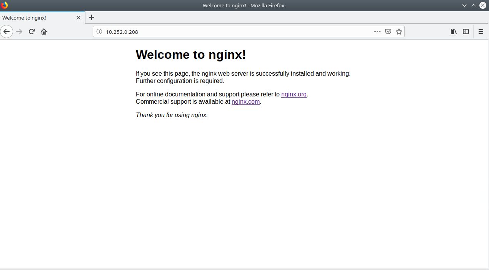

# My First Deploy on K8s

In this case, we have to launch nginx container in our Kubernetes cluster.

## Steps to execution

&nbsp;&nbsp;&nbsp;&nbsp;&nbsp;&nbsp; **1.** Create Deployment

&nbsp;&nbsp;&nbsp;&nbsp;&nbsp;&nbsp; **2.** Create Service

&nbsp;&nbsp;&nbsp;&nbsp;&nbsp;&nbsp; **3.** Access to Service

First we have to create the `nginx_deployment.yaml` file with the next syntax
```
apiVersion: apps/v1 # for versions before 1.9.0 use apps/v1beta2
kind: Deployment
metadata:
  name: nginx-deployment
  namespace: default
spec:
  selector:
    matchLabels:
      app: nginx
  replicas: 2 # tells deployment to run 2 pods matching the template
  template:
    metadata:
      labels:
        app: nginx
    spec:
      containers:
      - name: nginx
        image: nginx:1.7.9
        ports:
        - containerPort: 80
```

Then we have to create deployment object on Kubernetes cluster
```
kubectl create -f nginx_deployment.yaml
```
after that, we have to create `nginx_service.yaml` with the next syntax
```
apiVersion: v1
kind: Service
metadata:
  name: nginx
  namespace: default
  labels:
    k8s-app: nginx
spec:
  selector:
    app: nginx
  ports:
  - name: nginx
    port: 80
    protocol: TCP
```

Finally, we have to see the IP of the service with the command `kubectl get svc` and see **CLUSTER-IP** column. Then we load service on browser.


