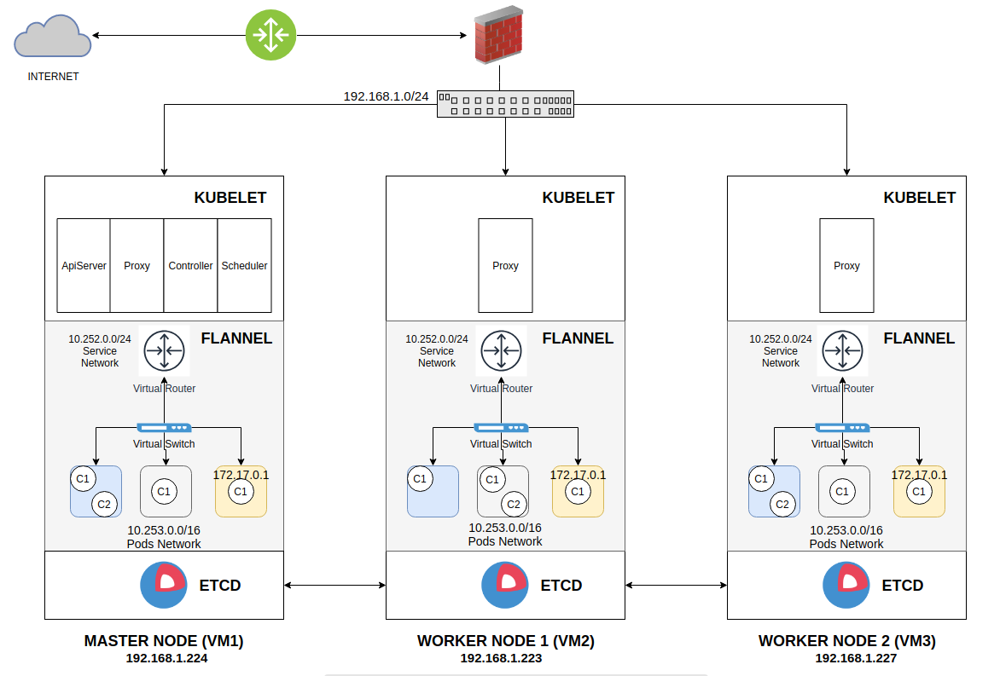

# Kubernetes

This is a practice guide for apply basic configuration in K8s Cluster. In this case we will have 3 Virtual Machines configure with etcd cluster and CoreOS Operative system.

## Prerequisites

**1.** Install 3 virtual machines in virtualbox

**2.** Install CoreOS in the 3 virtual machines. See the [guide](../CoreOS_Installation.md)

**3.** Install ETCD Cluster. See the [guide](../ETCD_Cluster_Installation.md)

The general explain to K8s cluster is represented un the next image



---

## Deploy Kubernetes Master Node

### TLS Assets

To Create CA and Cluster certificates TLS using Open SSL [Keys](https://coreos.com/kubernetes/docs/1.6.1/openssl.html)

Create the required directory and place the keys generated previously in the following locations:

```command
sudo mkdir -p /etc/kubernetes/ssl
```

- File: `/etc/kubernetes/ssl/ca.pem`
- File: `/etc/kubernetes/ssl/apiserver.pem`
- File: `/etc/kubernetes/ssl/apiserver-key.pem`

And make sure you've set proper permission for private key:

```command
sudo chmod 600 /etc/kubernetes/ssl/*-key.pem
sudo chown root:root /etc/kubernetes/ssl/*-key.pe
```

### Network Configuration

Networking is provided by Flannel, copy text [options.env](master/flannel/options.env).

```command
sudo mkdir -p /etc/flannel/
sudo vim /etc/flannel/options.env
```

Create service, copy text [40-ExecStartPre-symlink.conf](master/flannel/40-ExecStartPre-symlink.conf)

```command
sudo mkdir -p /etc/systemd/system/flanneld.service.d/
sudo vim /etc/systemd/system/flanneld.service.d/40-ExecStartPre-symlink.conf
```

### Docker Configuration

In order for flannel to manage the pod network in the cluster, Docker needs to be configured to use it. All we need to do is require that flanneld is running prior to Docker starting.
Create service, copy text [40-flannel.conf](40-flannel.conf)

```command
sudo mkdir -p /etc/systemd/system/docker.service.d/
sudo vim /etc/systemd/system/docker.service.d/40-flannel.conf
```

Create the Docker CNI Options file, copy text [docker_opts_cni.env](master/cni/docker_opts_cni.env)

```command
sudo mkdir /etc/kubernetes/cni/ -p
sudo vim /etc/kubernetes/cni/docker_opts_cni.env
```

Setup the Flannel CNI configuration, copy text [10-flannel.conf](master/cni/net.d/10-flannel.conf)

```command
sudo mkdir /etc/kubernetes/cni/net.d/ -p
sudo vim /etc/kubernetes/cni/net.d/10-flannel.conf
```

### Create the kubelet Unit

Create service, copy text [kubelet.service](master/kubelet.service)

```command
sudo vim /etc/systemd/system/kubelet.service
```

Copy text [kubeconfig.yaml](master/kubeconfig.yaml)

```command
sudo vim /etc/kubernetes/kubeconfig.yaml
```

### Set Up the kube-apiserver Pod

Copy text [kube-apiserver.yaml](master/manifests/kube-apiserver.yaml)

```command
sudo mkdir -p /etc/kubernetes/manifests/
sudo vim /etc/kubernetes/manifests/kube-apiserver.yaml
```

### Set Up the kube-proxy Pod

Copy text [kube-proxy.yaml](master/manifests/kube-proxy.yaml)

```command
sudo vim /etc/kubernetes/manifests/kube-proxy.yaml
```

### Set Up the kube-controller-manager Pod

Copy text [kube-controller-manager.yaml](master/manifests/kube-controller-manager.yaml)

```command
sudo vim /etc/kubernetes/manifests/kube-controller-manager.yaml
```

### Set Up the kube-scheduler Pod

Copy text [kube-scheduler.yaml](master/manifests/kube-scheduler.yaml)

```command
sudo vim /etc/kubernetes/manifests/kube-scheduler.yaml
```

### Configure flannel Network on ETCD

Registry the network PODS on etcd

```command
curl -X PUT -d "value={\"Network\":\"10.253.0.0/16\",\"Backend\":{\"Type\":\"vxlan\"}}" "http://192.168.1.224:2379/v2/keys/coreos.com/network/config"
```

### Load Changed Units

```command
sudo systemctl daemon-reload
```

### Start Flannel

```command
sudo systemctl start flanneld
sudo systemctl enable flanneld
```

### Start kubelet

```command
sudo systemctl start kubelet
sudo systemctl enable kubelet
```

### Basic Health Checks

First, we need to make sure the Kubernetes API is available (this could take a few minutes after starting the kubelet.service)

```command
curl http://127.0.0.1:8080/version
```

A successful response should look something like:

```json
{
  "major": "",
  "minor": "",
  "gitVersion": "v1.9.1+coreos.0",
  "gitCommit": "49020061462317aa0d54c2577f5bfb257e9cf58e",
  "gitTreeState": "clean",
  "buildDate": "2018-01-08T18:21:24Z",
  "goVersion": "go1.9.2",
  "compiler": "gc",
  "platform": "linux/amd64"
}
```

To check the health of the kubelet systemd unit that we created, run `systemctl status kubelet.service`.

Our Pods should now be starting up and downloading their containers. Once the kubelet has started, you can check it's creating its pods via the metadata api:

```command
curl -s localhost:10255/pods | jq -r '.items[].metadata.name'
```

A successful response should look something like:

```command
kube-scheduler-$node
kube-apiserver-$node
kube-controller-$node
kube-proxy-$node
```

## Deploy Kubernetes Worker Node

### TLS Assets for Worker Node

Place the TLS keypairs generated previously in the following locations:

- File: `/etc/kubernetes/ssl/ca.pem`
- File: `/etc/kubernetes/ssl/k8s-worker.pem`
- File: `/etc/kubernetes/ssl/k8s-worker-key.pem`

```command
sudo mkdir -p /etc/kubernetes/ssl
```

Copy certificates from Master. And make sure you've set proper permission for private key:

```command
sudo chmod 600 /etc/kubernetes/ssl/*-key.pem
sudo chown root:root /etc/kubernetes/ssl/*-key.pem
```

Create symlinks to the worker-specific certificate and key so that the remaining configurations on the workers do not have to be unique per worker.

```command
sudo ln -s /etc/kubernetes/ssl/k8s-worker.pem /etc/kubernetes/ssl/worker.pem
sudo ln -s /etc/kubernetes/ssl/k8s-worker-key.pem /etc/kubernetes/ssl/worker-key.pem
```

### Networking Configuration for Worker Node

Networking is provided by Flannel, copy text [options.env](nodes/flannel/options.env).

```command
sudo mkdir -p /etc/flannel/
sudo vim /etc/flannel/options.env
```

Create service, copy text [40-ExecStartPre-symlink.conf](nodes/flannel/40-ExecStartPre-symlink.conf)

```command
sudo mkdir -p /etc/systemd/system/flanneld.service.d/
sudo vim /etc/systemd/system/flanneld.service.d/40-ExecStartPre-symlink.conf
```

### Docker Configuration for Worker Node

In order for flannel to manage the pod network in the cluster, Docker needs to be configured to use it. All we need to do is require that flanneld is running prior to Docker starting.
Create service, copy text [40-flannel.conf](nodes/docker/docker.service.d/40-flannel.conf)

```command
sudo mkdir -p /etc/systemd/system/docker.service.d/
sudo vim /etc/systemd/system/docker.service.d/40-flannel.conf
```

Create the Docker CNI Options file, copy text [docker_opts_cni.env](nodes/cni/docker_opts_cni.env)

```command
sudo mkdir /etc/kubernetes/cni/ -p
sudo vim /etc/kubernetes/cni/docker_opts_cni.env
```

Setup the Flannel CNI configuration, copy text [10-flannel.conf](nodes/cni/net.d/10-flannel.conf)

```command
sudo mkdir /etc/kubernetes/cni/net.d/ -p
sudo vim /etc/kubernetes/cni/net.d/10-flannel.conf
```

### Create the kubelet Unit for Worker Node

Copy text [kubelet.service](nodes/kubelet.service)

```command
sudo vim /etc/systemd/system/kubelet.service
```

### Set Up the kube-proxy Pod for Worker Node

Create dir `/etc/kubernetes/manifests/` and copy text [kube-proxy.yaml](nodes/manifests/kube-proxy.yaml)

```command
sudo mkdir -p /etc/kubernetes/manifests/
sudo vim /etc/kubernetes/manifests/kube-proxy.yaml
```

### Set Up kubeconfig for Worker Node

Copy text [worker-kubeconfig.yaml](nodes/worker-kubeconfig.yaml)

```command
sudo vim /etc/kubernetes/worker-kubeconfig.yaml
```

### Load Changed Units for for Worker Node Worker Node

```command
sudo systemctl daemon-reload
```

### Start Flannel for Worker Node

```command
sudo systemctl start flanneld
sudo systemctl enable flanneld
```

### Start kubelet for Worker Node

```command
sudo systemctl start kubelet
sudo systemctl enable kubelet
```

## Setting up kubectl

Place the TLS keypairs generated previously in the following locations:

- File: /etc/kubernetes/ssl/ca.pem
- File: /etc/kubernetes/ssl/admin-key.pem
- File: /etc/kubernetes/ssl/admin.pem

### Download the kubectl Executable

```command
curl -O https://storage.googleapis.com/kubernetes-release/release/v1.9.1/bin/linux/amd64/kubectl
```

After downloading the binary, ensure it is executable and move it into your `PATH`:

```command
chmod +x kubectl
sudo mv kubectl /usr/bin/kubectl
```

### Configure kubectl

- Replace ${MASTER_HOST} with the master node address or name used in previous steps
- Replace ${CA_CERT} with the absolute path to the ca.pem created in previous steps
- Replace ${ADMIN_KEY} with the absolute path to the admin-key.pem created in previous steps
- Replace ${ADMIN_CERT} with the absolute path to the admin.pem created in previous steps

```command
kubectl config set-cluster default-cluster --server=https://${MASTER_HOST} --certificate-authority=${PATH_CA_CERT}
kubectl config set-credentials default-admin --certificate-authority=${PATH_CA_CERT} --client-key=${PATH_ADMIN_KEY} --client-certificate=${PATH_ADMIN_CERT}
kubectl config set-context default-system --cluster=default-cluster --user=default-admin
kubectl config use-context default-system
```

### Verify kubectl version is equal to Coreos (Server version)

```command
kubectl version
```

A successful response should look something like:

```json
Client Version: version.Info{Major:"1", Minor:"9", GitVersion:"v1.9.1", GitCommit:"3a1c9449a956b6026f075fa3134ff92f7d55f812", GitTreeState:"clean", BuildDate:"2018-01-04T11:52:23Z", GoVersion:"go1.9.2", Compiler:"gc", Platform:"linux/amd64"}
Server Version: version.Info{Major:"", Minor:"", GitVersion:"v1.9.1+coreos.0", GitCommit:"49020061462317aa0d54c2577f5bfb257e9cf58e", GitTreeState:"clean", BuildDate:"2018-01-08T18:21:24Z", GoVersion:"go1.9.2", Compiler:"gc", Platform:"linux/amd64"}
```

### Config Master Node unschedulable

```command
kubectl label node ${MASTER-NODE} kubernetes.io/role=master
kubectl patch node ${MASTER-NODE} -p '{"spec":{"unschedulable": true}}'
```