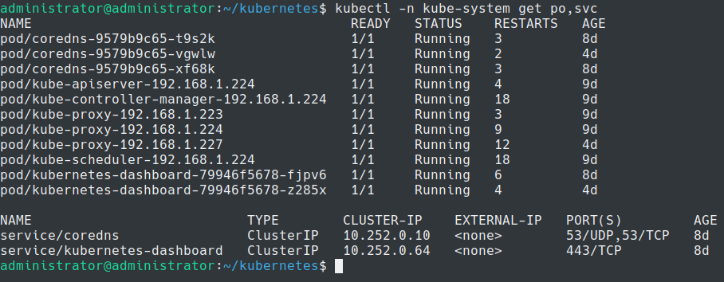
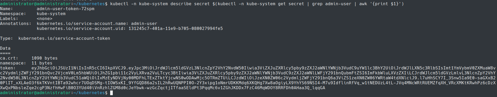
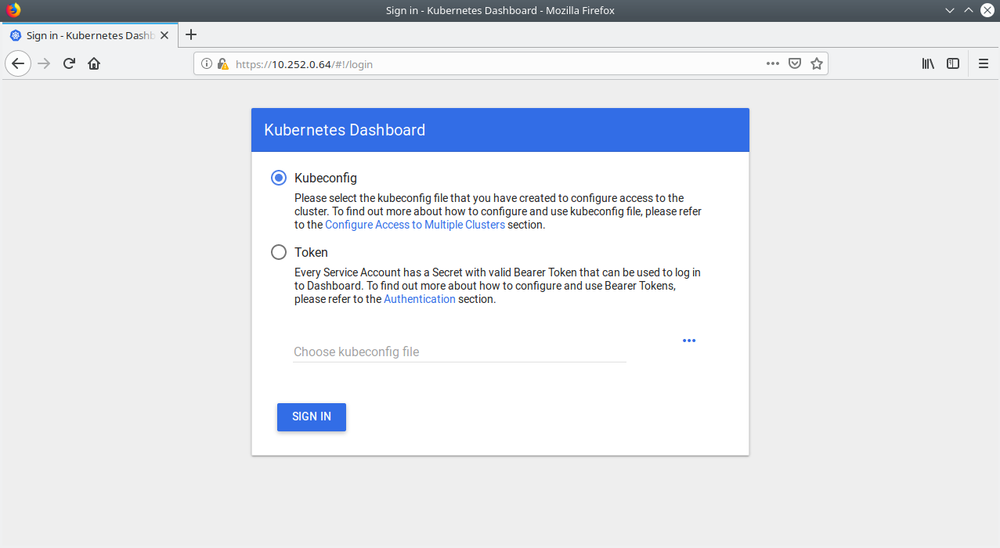

# Deploy Dashboard in Kubernetes

Dashboard is an add-on, which allow visualize and manage some kubernetes functionalities. Additionally, offers a Graphic User Interface for keep organized all kubernetes components.

## Steps to execution

In this guide we have a cluster that use RBAC for manages users permission. Thus, this configuration isn't apply on ABAC.

&nbsp;&nbsp;&nbsp;&nbsp;&nbsp;&nbsp; **1.** Create Secrets.

&nbsp;&nbsp;&nbsp;&nbsp;&nbsp;&nbsp; **2.** Create Service Account.

&nbsp;&nbsp;&nbsp;&nbsp;&nbsp;&nbsp; **3.** Create dashboard role and role binding

&nbsp;&nbsp;&nbsp;&nbsp;&nbsp;&nbsp; **4.** Create Deployment

&nbsp;&nbsp;&nbsp;&nbsp;&nbsp;&nbsp; **5.** Create Service

For this case, we have created a yaml file, from the node where kubectl is installed (this is an external node of the cluster). The file was named ```deploy_dashboard.yaml```, and its specification is found below

```command
# ------------------- Dashboard Secrets ------------------- #

apiVersion: v1
kind: Secret
metadata:
  labels:
    k8s-app: kubernetes-dashboard
  name: kubernetes-dashboard-certs
  namespace: kube-system
type: Opaque

---

apiVersion: v1
kind: Secret
metadata:
  labels:
    k8s-app: kubernetes-dashboard
  name: kubernetes-dashboard-csrf
  namespace: kube-system
type: Opaque
data:
  csrf: ""

---
# ------------------- Dashboard Service Account ------------------- #

apiVersion: v1
kind: ServiceAccount
metadata:
  labels:
    k8s-app: kubernetes-dashboard
  name: kubernetes-dashboard
  namespace: kube-system

---
# ------------------- Dashboard Role & Role Binding ------------------- #

kind: Role
apiVersion: rbac.authorization.k8s.io/v1
metadata:
  name: kubernetes-dashboard-minimal
  namespace: kube-system
rules:
  # Allow Dashboard to create 'kubernetes-dashboard-key-holder' secret.
- apiGroups: [""]
  resources: ["secrets"]
  verbs: ["create"]
  # Allow Dashboard to create 'kubernetes-dashboard-settings' config map.
- apiGroups: [""]
  resources: ["configmaps"]
  verbs: ["create"]
  # Allow Dashboard to get, update and delete Dashboard exclusive secrets.
- apiGroups: [""]
  resources: ["secrets"]
  resourceNames: ["kubernetes-dashboard-key-holder", "kubernetes-dashboard-certs", "kubernetes-dashboard-csrf"]
  verbs: ["get", "update", "delete"]
  # Allow Dashboard to get and update 'kubernetes-dashboard-settings' config map.
- apiGroups: [""]
  resources: ["configmaps"]
  resourceNames: ["kubernetes-dashboard-settings"]
  verbs: ["get", "update"]
  # Allow Dashboard to get metrics from heapster.
- apiGroups: [""]
  resources: ["services"]
  resourceNames: ["heapster"]
  verbs: ["proxy"]
- apiGroups: [""]
  resources: ["services/proxy"]
  resourceNames: ["heapster", "http:heapster:", "https:heapster:"]
  verbs: ["get"]

---
apiVersion: rbac.authorization.k8s.io/v1
kind: RoleBinding
metadata:
  name: kubernetes-dashboard-minimal
  namespace: kube-system
roleRef:
  apiGroup: rbac.authorization.k8s.io
  kind: Role
  name: kubernetes-dashboard-minimal
subjects:
- kind: ServiceAccount
  name: kubernetes-dashboard
  namespace: kube-system

---
# ------------------- Dashboard Deployment ------------------- #

kind: Deployment
apiVersion: apps/v1
metadata:
  labels:
    k8s-app: kubernetes-dashboard
  name: kubernetes-dashboard
  namespace: kube-system
spec:
  replicas: 1
  revisionHistoryLimit: 10
  selector:
    matchLabels:
      k8s-app: kubernetes-dashboard
  template:
    metadata:
      labels:
        k8s-app: kubernetes-dashboard
    spec:
      containers:
      - name: kubernetes-dashboard
        image: k8s.gcr.io/kubernetes-dashboard-amd64:v1.10.1
        ports:
        - containerPort: 8443
          protocol: TCP
        args:
          - --auto-generate-certificates
        volumeMounts:
        - name: kubernetes-dashboard-certs
          mountPath: /certs
          # Create on-disk volume to store exec logs
        - mountPath: /tmp
          name: tmp-volume
        livenessProbe:
          httpGet:
            scheme: HTTPS
            path: /
            port: 8443
          initialDelaySeconds: 30
          timeoutSeconds: 30
      volumes:
      - name: kubernetes-dashboard-certs
        secret:
          secretName: kubernetes-dashboard-certs
      - name: tmp-volume
        emptyDir: {}
      serviceAccountName: kubernetes-dashboard
      # Comment the following tolerations if Dashboard must not be deployed on master
      tolerations:
      - key: node-role.kubernetes.io/master
        effect: NoSchedule

---
# ------------------- Dashboard Service ------------------- #

kind: Service
apiVersion: v1
metadata:
  labels:
    k8s-app: kubernetes-dashboard
  name: kubernetes-dashboard
  namespace: kube-system
spec:
  ports:
    - port: 443
      targetPort: 8443
  selector:
    k8s-app: kubernetes-dashboard
```

after that, we have to apply the changes with the command 
```command
kubectl apply -f deploy_dashboard.yaml
```

For see, the IP service for the dashboard execute the next command, and visualize **CLUSTER-IP** column
```
kubectl -n kube-system get po,svc
```


Then we have to connect to cluster node with -D parameter, with the purpose to use like proxy and visualize network service of the services.
```
ssh -o TCPKeepAlive=yes -o ServerAliveInterval=15 ${USERNAME}@${IP_ADDRESS} -D{PORT_NUMBER}
```

Then, we have to get admin token for connect us in the dashboard

```
kubectl -n kube-system describe secret $(kubectl -n kube-system get secret | grep admin-user | awk '{print $1}')
```



Finally, we connect us in the dashboard, with the **IP**, **PORT**, **PROXY** and **ADMIN-TOKEN**

