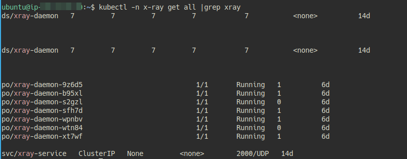
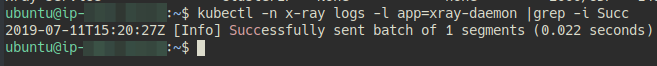
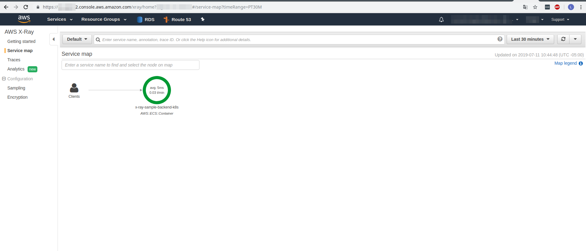
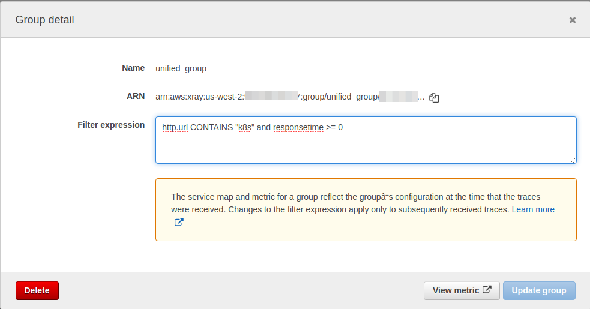

### X-RAY AWS

## What's x-ray?

AWS X-Ray helps developers analyze and debug production, distributed applications, such as those built using a microservices architecture. With X-Ray, you can understand how your application and its underlying services are performing to identify and troubleshoot the root cause of performance issues and errors. X-Ray provides an end-to-end view of requests as they travel through your application, and shows a map of your application’s underlying components. You can use X-Ray to analyze both applications in development and in production, from simple three-tier applications to complex microservices applications consisting of thousands of services.


## Exercise

In this case we are going to explain the installation in kubernetes of x-ray aws agent, and we will use a small application to understand and visualize a simple microservice called in the aws console.

1. We have to create the Dockerfile to build the image, https://github.com/ldelgadop44/General_Documentation/xray-aws/x-ray_daemon/Dockerfile , Then execute:

```
docker build -t ldelgadop/xray .

docker push ldelgadop/xray
```

2. Secondly, we have to create yaml file for deploy x-ray agent. For this task, use this file https://github.com/ldelgadop44/General_Documentation/xray-aws/x-ray_daemon/xray-DaemonSet.yaml and https://github.com/ldelgadop44/General_Documentation/xray-aws/x-ray_daemon/credentials.yaml

##### NOTE: 
For the credencials we have to use a AWS user with AWSXRayDaemonWriteAccess Policy. After that, all pods needs this user to send traces an data to AWS Server. This means that pods will have a volume path with this credentials. In this case, we are going to manage follow structure 

```
[default]
aws_access_key_id = value_for_user
aws_secret_access_key = value_for_user

```

Further, this structure will should be encoding with base64, and that value will be sent at the secret in the `credencials.yaml` file.

Then, we have to create the secret credentials.yaml and other components to xray-daemon, for this we will execute

```
kubectl create ns x-ray

kubectl create -f credentials.yaml

kubectl create -f xray-DaemonSet.yaml

```

Then, we will execute ```kubectl -n x-ray get all |grep xray```, and all pods should be in 'Running' state



3. Once the service is deployed, we have to create an application example for testing the communication between agent and server. For this, is necessary build Docker image that will be deployed in the k8s cluster with Dockerfile and the rest files located in backend folder.

```
docker build -t ldelgadop/example-backend-go .

docker push ldelgadop/example-backend-go

```

4. After that, we have to create yaml file to deploy the `example-backend` application, for this use the `example-backend.yaml` and execute

```
kubectl create -f example-backend.yaml

```

5. We have to launch a pod with alpine image to test application access. for this, use `alpine.yaml` file and then execute

```
kubectl create -f alpine.yaml

kubectl exec -it alpine sh

apk update

apk add curl

curl -Lv http://x-ray-sample-backend-k8s.x-ray.svc.cluster.local

```



In the picture we can see that after send the curl request, the xray pods agents show Succesful message in thier logs.

Now, we have see the request in the aws console for xray https://console.aws.amazon.com/xray/home#/service-map



##### EXTRA:

If you want split microservices by different customers, you can create create groups with next rule, for example

